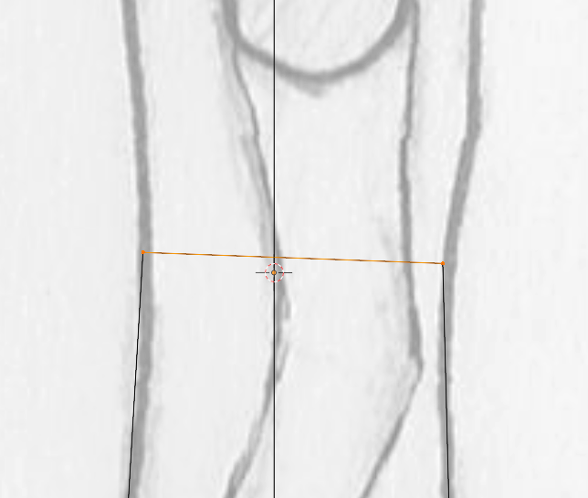
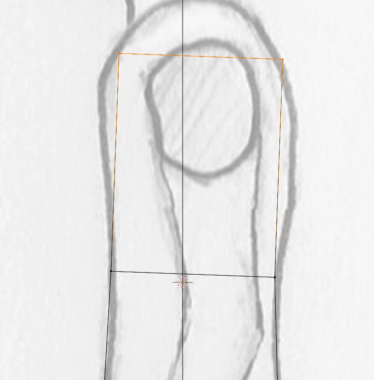

Select vertices that you want to extrude from, these should all be from one of the side, like in the image.

Now press [E](../Object%20mode%205d7f4d1a5e73459fa1561248946ec210.md) to extrude the selected vertices and move your mouse it the direction you want to extrude.

