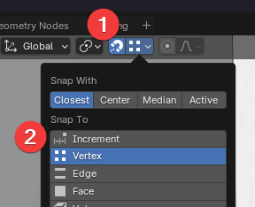
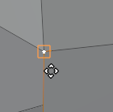

At top change **Snap to** to **Vertex.**

Now select the vertex you want to join and press Ctrl and hover over the vertex you want to join it to.

Finally merge the vertices by selecting all, right-clicking and selecting **Merge vertices** > **By distance**
