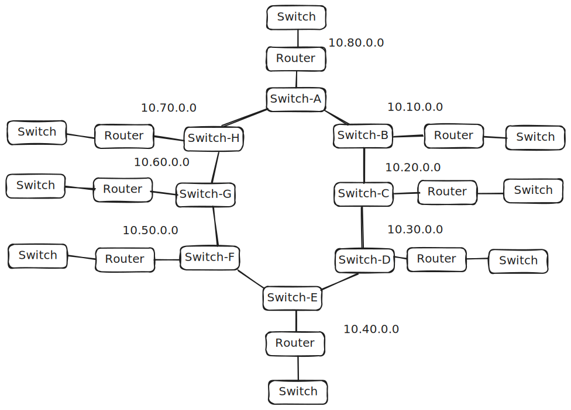
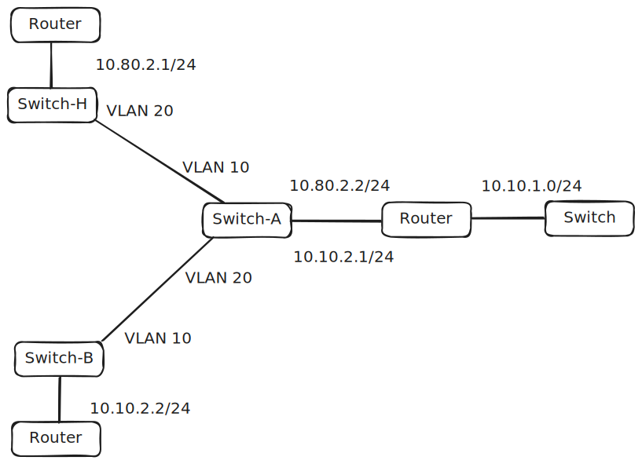

**VLAN 10** is the one going from the previous group.

**VLAN 20** is the one going to the next group

Setup the access ports for the other routers. First set the trunk port

```
int fa0/1
switchport mode trunk
switchport trunk allowed vlan 10,20
no shutdown
exit
```

Now set the access ports

```
int fa0/2
switchport mode access
switchport access vlan 10
no shutdown
```

```
int fa0/3
switchport mode access
switchport access vlan 20
no shutdown
```

---

Setup vlans on **router.** The Gigabit Ethernet 0/0/0 is the interface going to the switch for the outside. First start the interface and make sure it has no ip address

```
int gig 0/0/0
no shutdown
no ip address
exit
```

Now set the vlan subinterfaces.

```
int gig 0/0/0.10
encapsulation dot1q 10
ip address 10.60.2.2 255.255.255.0
exit
```

```
int gig 0/0/0.20
encapsulation dot1q 20
ip address 10.70.2.1 255.255.255.0
exit
```

---

Set the home network. This happens on the **router** on the interface going to the switch for home network. First set the ip address for the router.

```
int gig 0/0/1
ip address 10.70.1.1 255.255.255.0
no shutdown
exit
```

Now set the DHCP for the network

```
ip dhcp pool home
network 10.70.1.0 255.255.255.0
default-router 10.70.1.1
exit
```

---

To finish this set the routes for the other networks.

```
ip route 0.0.0.0 0.0.0.0 gig 0/0/0.20
```

Completed topology inside of Cisco Packet Tracer (8.2.2.0400)

[ring-topology.pkt](/cisco/ring-topology.pkt)
